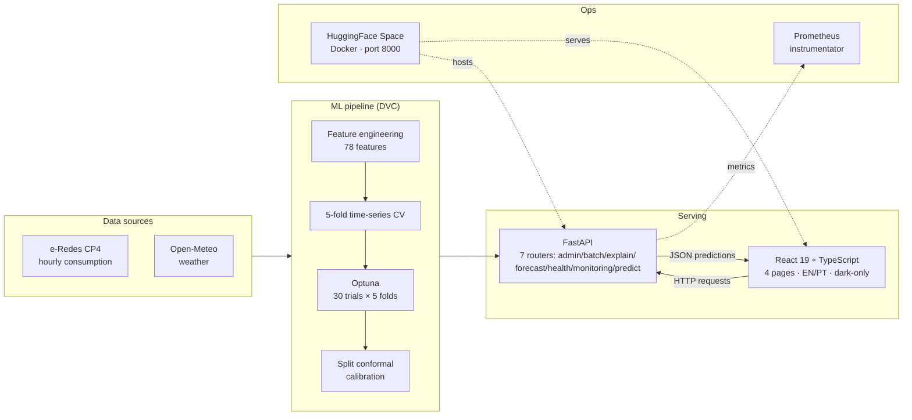

# Energy Forecast PT

[](https://github.com/Pedrom2002/energy-forecast-pt/actions/workflows/ci-cd.yml)
[](https://www.python.org/downloads/)
[](https://github.com/Pedrom2002/energy-forecast-pt/blob/master/LICENSE)
[]()
[](https://fastapi.tiangolo.com/)
[]()

> **Live demo:** [pedrom02-energy-forecast-pt.hf.space](https://pedrom02-energy-forecast-pt.hf.space) &nbsp;·&nbsp; **Source:** [github.com/Pedrom2002/energy-forecast-pt](https://github.com/Pedrom2002/energy-forecast-pt)

> **Demo model (no_lags):** MAPE 4.77%, RMSE 53.52 MW &nbsp;·&nbsp; **Production model (with_lags):** MAPE 1.44%, RMSE 22.90 MW &nbsp;·&nbsp; **R² 0.998** &nbsp;·&nbsp; **EN / PT i18n** &nbsp;·&nbsp; **760+ tests**

> 📖 **Reviewer / recruiter shortcut →** [**docs/DECISIONS.md**](docs/DECISIONS.md) explains the non-obvious trade-offs: why I threw out a "1.6% MAPE" model for leakage, why the public demo serves the worse model on purpose, what I cut because it wasn't defensible, and the cross-region swap test ([`scripts/verify_no_cross_region_leakage.py`](scripts/verify_no_cross_region_leakage.py)) that empirically falsifies the leakage hypothesis in the new model.

Full-stack energy consumption forecasting system for Portugal by region. Gradient-boosted tree models (XGBoost / LightGBM / CatBoost) with a modern React 19 frontend, bilingual (English/Portuguese), dark-only UI, and a one-click HuggingFace Spaces deployment.

The public demo runs the **no_lags** model (MAPE 4.77%) because the Space has no real consumption feed. The **with_lags** model (MAPE 1.44%) is available via `POST /predict/sequential` for integrations that can supply 48 h of consumption history.

Fully reproducible ML pipeline with baseline comparison, Optuna hyperparameter tuning, permutation-importance feature selection, split conformal prediction calibration, and file-based experiment tracking.

## Architecture



## Key Results

Numbers taken directly from `data/models/metadata/training_metadata.json` and `training_metadata_no_lags.json` (pipeline v8, trained 2026-04-11, seed 42).

| Variant | MAE (MW) | RMSE (MW) | MAPE | R² | MASE | Features | Best Model | Role |
|---------|----------|-----------|------|-----|------|----------|------------|------|
| **with_lags** | 13.50 | 22.90 | **1.44%** | **0.9979** | 0.022 | 78 | XGBoost | Production (`/predict/sequential`) |
| no_lags | 37.22 | 53.52 | 4.77% | 0.9885 | 0.048 | 56 | XGBoost | Public demo (`/predict`, `/predict/batch`) |

- **Pipeline v8**: Optuna hyperparameter tuning (30 trials, walk-forward CV) + split conformal calibration
- **61% RMSE reduction** over best baseline (Persistence 58.74) — 2.6x better
- **MASE 0.022** (with_lags) — model error ~2% of seasonal naive error
- **90% conformal prediction intervals** computed on a held-out calibration half (split conformal)
- **5 regions**: Alentejo, Algarve, Centro, Lisboa, Norte
- **40,075 samples** (39,835 after feature engineering) of REAL regional hourly data (2022-11-01 to 2023-09-30), sourced from e-Redes `consumos_horario_codigo_postal` (CP4) + Open-Meteo

## Prerequisites

- **Python 3.11+**
- `git`
- (Optional) Docker for containerised deployment
- (Optional) Redis for distributed rate limiting

## Quick Start

### 1. Installation

```bash
python -m venv .venv
.venv\Scripts\activate        # Windows
# source .venv/bin/activate   # Linux/Mac

pip install -r requirements.txt
pip install -r requirements-dev.txt   # for tests and lint

cp .env.example .env
```

### 2. Train Models

**End-to-end refresh + retrain (recommended)** — downloads fresh data from
e-Redes + Open-Meteo, rebuilds the dataset, validates, and retrains:

```bash
./scripts/refresh_and_retrain.sh                  # full pipeline
./scripts/refresh_and_retrain.sh --skip-download  # use existing raw data
./scripts/refresh_and_retrain.sh --multistep      # also train 1h/6h/12h/24h horizons
```

Manual steps if you only want to retrain on existing data:

```bash
# Full pipeline (baselines, 5-fold CV, feature selection, conformal calibration)
python scripts/retrain.py

# Fast iteration (skip Optuna tuning, recommended for development)
python scripts/retrain.py --skip-optuna --skip-advanced

# Also train horizon-specific models (1h, 6h, 12h, 24h)
python scripts/retrain.py --skip-optuna --multistep
```

The data ingestion pipeline lives in `scripts/data_pipeline/` — see its
[README](scripts/data_pipeline/README.md) for details on the v8 honest
regional approach.

A monthly automated retrain is configured via
[`.github/workflows/retrain-monthly.yml`](.github/workflows/retrain-monthly.yml)
which runs on the 1st of each month and opens a PR with the refreshed model
if metrics did not regress.

This produces:
- `data/models/checkpoints/best_model.pkl` (with lags, primary)
- `data/models/checkpoints/best_model_no_lags.pkl` (no lags, fallback)
- Metadata, feature names, and experiment logs in `data/models/` and `experiments/`

### 3. Run Analysis Notebooks (optional)

```bash
# Generate notebooks (analysis-only, no model training)
python scripts/generate_notebooks.py

# Run all analysis notebooks
python run_notebooks.py
```

Notebooks:
| # | Name | Purpose |
|---|------|---------|
| 01 | Exploratory Data Analysis | EDA, distributions, temporal patterns, correlations |
| 02 | Model Evaluation | Load and compare all 3 model variants |
| 03 | Advanced Feature Analysis | Feature correlations, mutual information, importance |
| 04 | Error Analysis | Error by region, hour, season; residual diagnostics |
| 05 | Robust Validation | Walk-forward CV, seasonal backtest, seed stability |

### 4. Run API

```bash
uvicorn src.api.main:app --reload
```

- API: **http://localhost:8000**
- Interactive docs: **http://localhost:8000/docs**
- Health check: **http://localhost:8000/health**

### 5. Run Frontend

```bash
cd frontend
npm install
npm run dev
```

- Frontend: **http://localhost:3000**
- **4 pages**: Dashboard (entry), Previsão Pontual (single-point `/predict`), Forecast (sequential batch — uses `no_lags` via `/predict/batch`, has an embedded SHAP explainability panel), Monitoring (CI coverage tracker).
- **i18n**: English default + Portuguese, switched from a footer toggle (`react-i18next`).
- **Dark-only UI**: light-mode tokens remain in the theme but no toggle is exposed.
- Toast notifications, CSV export, virtualized tables.

> The former stand-alone **Batch** page has been merged into **Forecast**; the **Explicabilidade** page has been replaced by a collapsible explainability panel inside **Forecast**.

The API auto-loads models from `data/models/checkpoints/`: `best_model.pkl` (with_lags) and `best_model_no_lags.pkl` (no_lags). Endpoints select the appropriate variant automatically — `/predict`, `/predict/batch` and `/predict/explain` default to the no_lags model unless the request provides 48 h of consumption history, while `/predict/sequential` always uses the with_lags model and feeds its own predictions back as lag inputs.

## API Endpoints

### Core

| Method | Endpoint | Description |
|--------|----------|-------------|
| `GET` | `/` | API info |
| `GET` | `/health` | Liveness probe (version, uptime, model status, coverage alert) |
| `GET` | `/regions` | List of 5 valid regions |
| `GET` | `/limitations` | Rate limits, model requirements, CI method |
| `GET` | `/model/info` | Model metadata, training metrics, SHA-256 checksums |
| `GET` | `/model/drift` | Training-time feature distribution baselines |
| `POST` | `/model/drift/check` | Compare live features against training baseline (z-score) |

### Predictions

| Method | Endpoint | Description |
|--------|----------|-------------|
| `POST` | `/predict` | Single prediction with 90% CI |
| `POST` | `/predict/batch` | Batch predictions (up to 1000 items, vectorised) |
| `POST` | `/predict/sequential` | Lag-aware auto-regressive forecast with history |
| `POST` | `/predict/explain` | Prediction + top-N feature importance (SHAP or global) |

### Monitoring

| Method | Endpoint | Description |
|--------|----------|-------------|
| `GET` | `/metrics/summary` | Operational metrics snapshot |
| `GET` | `/model/coverage` | Sliding-window empirical CI coverage (168 observations) |
| `POST` | `/model/coverage/record` | Record actual observation for coverage tracking |

### Admin (requires `ADMIN_API_KEY`)

| Method | Endpoint | Description |
|--------|----------|-------------|
| `POST` | `/admin/reload-models` | Hot-reload models from disk without restart |

### Example: `POST /predict`

**Request:**
```json
{
  "timestamp": "2024-12-31T14:00:00",
  "region": "Lisboa",
  "temperature": 18.5,
  "humidity": 65.0,
  "wind_speed": 12.3,
  "precipitation": 0.0,
  "cloud_cover": 40.0,
  "pressure": 1015.0
}
```

**Response:**
```json
{
  "timestamp": "2024-12-31T14:00:00",
  "region": "Lisboa",
  "predicted_consumption_mw": 2850.5,
  "confidence_interval_lower": 2817.2,
  "confidence_interval_upper": 2883.8,
  "ci_method": "conformal",
  "ci_lower_clipped": false,
  "model_name": "CatBoost (with lags)",
  "confidence_level": 0.90
}
```

## ML Pipeline (v8)

The training pipeline (`scripts/retrain.py`) executes 12 steps per model variant:

```
1.  Set global seed (42) for reproducibility
2.  Load data + compute SHA-256 hash
3.  Feature engineering (temporal, lags, rolling, weather-derived, holidays, interactions)
4.  Temporal split 70/15/15 (no shuffling)
5.  Baseline evaluation (persistence, seasonal naive daily/weekly, MA 24h/168h)
6.  Model selection via 5-fold time-series CV (XGBoost, LightGBM, CatBoost, RF)
7.  Optuna hyperparameter optimisation (50 trials, 5 CV folds, TPE sampler)
8.  Feature selection (correlation filter |r|>0.95 + permutation importance)
9.  Final training on train+val with best model + best params
10. Test evaluation (MAE, RMSE, MAPE, R², NRMSE, MASE) + conformal q90
11. Save artefacts (checkpoint, features, metadata with feature_stats)
12. Log to experiment tracker (experiments/<run_id>.json)
```

See [docs/ML_PIPELINE.md](docs/ML_PIPELINE.md) for full technical details.

## Project Structure

```
energy-forecast-pt/
├── src/
│   ├── api/
│   │   ├── main.py                    # FastAPI app, routes, lifespan
│   │   ├── middleware.py              # Rate limiting, security headers
│   │   ├── prediction.py             # Inference, CI computation
│   │   ├── schemas.py                # Pydantic request/response models
│   │   └── store.py                  # ModelStore, hot-reload, checksums
│   ├── features/
│   │   └── feature_engineering.py    # Feature engineering (temporal, lags, rolling, weather, holidays)
│   ├── models/
│   │   ├── baselines.py             # 5 baseline models (persistence, seasonal, MA)
│   │   ├── evaluation.py            # Metrics, CV, CoverageTracker
│   │   ├── experiment_tracker.py    # File-based experiment logging
│   │   ├── feature_selection.py     # Correlation filter + permutation importance
│   │   ├── metadata.py             # Model metadata I/O
│   │   └── model_registry.py       # Model factory, training, Optuna search spaces
│   └── utils/
│       ├── config.py / config_loader.py
│       ├── logger.py                # Structured logging
│       ├── metrics.py               # MAE, RMSE, MAPE, R², NRMSE, MASE
│       └── reproducibility.py       # Global seeds, environment snapshots, data hashing
│
├── scripts/
│   ├── retrain.py                   # Production training pipeline (v8)
│   └── generate_notebooks.py        # Generate analysis notebooks
│
├── notebooks/                        # Analysis-only (no model training/saving)
│   ├── 01_exploratory_data_analysis.ipynb
│   ├── 02_model_evaluation.ipynb
│   ├── 03_advanced_feature_analysis.ipynb
│   ├── 04_error_analysis.ipynb
│   └── 05_robust_validation.ipynb
│
├── data/
│   ├── processed/
│   │   └── processed_data.parquet   # 40,075 rows, hourly, 5 regions (real regional CP4 data, 2022-11 to 2023-09)
│   └── models/
│       ├── checkpoints/             # .pkl model files
│       ├── features/                # feature name lists
│       └── metadata/                # training metadata JSON
│
├── experiments/                      # Experiment tracking logs
│   ├── index.json                   # Summary of all runs
│   └── <run_id>.json               # Full experiment record per run
│
├── frontend/                        # React 19 + TypeScript + Vite
│   ├── src/
│   │   ├── pages/                  # 4 pages (Dashboard, Predict, Forecast, Monitoring)
│   │   ├── components/             # Card, Layout, Toast, ChartSkeleton, ErrorBoundary, etc.
│   │   ├── hooks/                  # useTheme, useDebounce
│   │   ├── utils/                  # Formatting utilities (formatMW, exportCSV, etc.)
│   │   └── api/                    # Type-safe API client
│   ├── vitest.config.ts            # Frontend test configuration
│   └── package.json                # React 19, Tailwind CSS v4, Recharts
│
├── tests/                            # 760+ backend tests (pytest) across 33 files
│   ├── test_api.py                 # API endpoint tests
│   ├── test_full_integration.py    # End-to-end integration (44 tests)
│   ├── test_property_based.py      # Hypothesis property-based (21 tests)
│   ├── test_load.py                # Load/performance tests (18 tests)
│   ├── test_stress.py              # Stress tests (13 tests)
│   └── ...                         # 19 more test files
│
├── docs/
│   ├── ML_PIPELINE.md              # Complete ML pipeline reference (12 steps)
│   ├── DATA_DICTIONARY.md          # All data schemas, features, metadata
│   ├── MODEL_CARD.md               # Model capabilities, limitations, ethics
│   ├── ARCHITECTURE.md             # System architecture
│   ├── DEPLOYMENT.md               # Cloud deployment guides
│   ├── MONITORING.md               # Production monitoring
│   ├── SECURITY.md                 # Security architecture
│   └── DECISIONS.md                # ADRs: trade-offs and reversals
│
├── deploy/
│   ├── deploy-aws.sh / aws-ecs.yml
│   ├── deploy-azure.sh / azure-container-app.yml
│   └── deploy-gcp.sh / gcp-cloud-run.yml
│
├── dvc.yaml                         # DVC pipeline (data versioning)
├── Dockerfile                       # Multi-stage, non-root, healthcheck
├── docker-compose.yml
├── requirements.txt
├── requirements-dev.txt
├── pyproject.toml                   # Centralised tool config (black, ruff, mypy, pytest)
├── .pre-commit-config.yaml          # Pre-commit hooks (black, isort, ruff, bandit)
└── .github/workflows/ci-cd.yml     # CI/CD (tests, lint, security, Docker, deploy)
```

## Authentication & Rate Limiting

- Set `API_KEY` env var to enable API key auth via `X-API-Key` header
- Set `ADMIN_API_KEY` for privileged endpoints (falls back to `API_KEY`)
- Rate limiting: 60 req/min per IP (configurable via `RATE_LIMIT_MAX`, `RATE_LIMIT_WINDOW`)
- Set `REDIS_URL` for distributed rate limiting (auto-fallback to in-memory)
- All env vars documented in [`.env.example`](.env.example)

## Testing

### Backend (Python)

```bash
# Run all 760+ tests
pytest -v

# With coverage report
pytest --cov=src --cov-report=html --cov-fail-under=85

# By category
pytest -m integration       # End-to-end integration tests
pytest -m property_based    # Hypothesis property-based tests
pytest -m load              # Performance/load tests
pytest -m stress            # Stress tests

# Mutation testing
bash scripts/run_mutation_tests.sh
```

### Frontend (React)

```bash
cd frontend
npm test                    # Run all 71 tests (Vitest)
npm run test:coverage       # With coverage report
npm run test:watch          # Watch mode
```

## Live Deployment — HuggingFace Spaces

The project is live at **https://pedrom02-energy-forecast-pt.hf.space**. The Space is configured as a Docker SDK (see the YAML front-matter at the top of this README), listens on port 8000, and serves both the FastAPI backend and the static React frontend bundled inside the same container.

No auth is required for the public demo. On startup the backend seeds **168 synthetic observations** into the coverage tracker (~92% empirical coverage) so the Monitoring page is never empty.

See [docs/DEPLOYMENT.md](docs/DEPLOYMENT.md#huggingface-spaces-live-demo) for a full walkthrough.

## Docker Deployment

```bash
# Build and run
docker build -t energy-forecast-api .
docker run -d -p 8000:8000 energy-forecast-api

# Or with docker-compose (includes nginx for production)
docker-compose up -d
docker-compose --profile production up -d
```

### Cloud Deployment

| Platform | Command | Guide |
|----------|---------|-------|
| AWS ECS Fargate | `./deploy/deploy-aws.sh` | [deploy/aws-ecs.yml](deploy/aws-ecs.yml) |
| Azure Container Apps | `./deploy/deploy-azure.sh` | [deploy/azure-container-app.yml](deploy/azure-container-app.yml) |
| GCP Cloud Run | `./deploy/deploy-gcp.sh` | [deploy/gcp-cloud-run.yml](deploy/gcp-cloud-run.yml) |

See [docs/DEPLOYMENT.md](docs/DEPLOYMENT.md) for complete guides.

## Reproducibility

Every training run is fully reproducible:

| Mechanism | Description |
|-----------|-------------|
| **Global seed** | `set_global_seed(42)` — numpy, random, PYTHONHASHSEED |
| **Data hashing** | SHA-256 of input DataFrame, X_train, y_train |
| **Environment snapshot** | Python version, git commit, package versions |
| **Experiment tracking** | Full config, metrics, artefacts in `experiments/<run_id>.json` |
| **DVC pipeline** | `dvc repro` for end-to-end reproducible runs |

```bash
# Reproduce a past experiment
cat experiments/index.json               # find run_id
cat experiments/<run_id>.json            # see full config + metrics
python scripts/retrain.py               # retrain with same seed
```

## CI/CD Pipeline

GitHub Actions (`.github/workflows/ci-cd.yml`):

| Stage | Tools | Threshold |
|-------|-------|-----------|
| **Tests** | pytest + coverage | 85% minimum |
| **Lint** | black, isort, ruff, mypy | Zero errors |
| **Security** | pip-audit, bandit, detect-secrets | Strict |
| **Build** | Docker + Trivy scan + SBOM | No CRITICAL/HIGH CVEs |
| **Benchmark** | pytest-benchmark | 20% regression threshold |
| **Deploy** | Staging (auto) → Production (manual approval) | Smoke tests |

## Documentation

| Document | Description |
|----------|-------------|
| [ML_PIPELINE.md](docs/ML_PIPELINE.md) | Complete 12-step pipeline reference |
| [DATA_DICTIONARY.md](docs/DATA_DICTIONARY.md) | All data schemas, features, metadata formats |
| [MODEL_CARD.md](docs/MODEL_CARD.md) | Model capabilities, limitations, ethical considerations |
| [ARCHITECTURE.md](docs/ARCHITECTURE.md) | System architecture and component design |
| [DEPLOYMENT.md](docs/DEPLOYMENT.md) | Docker + cloud deployment guides |
| [MONITORING.md](docs/MONITORING.md) | Production monitoring and alerting |
| [SECURITY.md](docs/SECURITY.md) | Security architecture |
| [DECISIONS.md](docs/DECISIONS.md) | ADRs explaining trade-offs and reversals (PT) |

## Troubleshooting

### API starts in degraded mode

No models found in `data/models/checkpoints/`. Train first:
```bash
python scripts/retrain.py --skip-optuna
```

### Confidence intervals say `rmse_calibrated: false`

Metadata files missing. Retrain to regenerate:
```bash
python scripts/retrain.py --skip-optuna
```

### Rate limiting returns `429 Too Many Requests`

```bash
export RATE_LIMIT_MAX=120      # max requests per window
export RATE_LIMIT_WINDOW=60    # window in seconds
```

### Sequential forecasting degrades beyond 24h

Expected behaviour — auto-regressive feedback accumulates error. For horizons > 48h, use `/predict/batch` with the no-lags model instead. Providing 7+ days of history (168 rows) improves accuracy.

## Tech Stack

| Category | Technologies |
|----------|--------------|
| **ML** | CatBoost, XGBoost, LightGBM, scikit-learn, Optuna |
| **Frontend** | React 19, TypeScript, Vite, Tailwind CSS v4, Recharts |
| **API** | FastAPI, Uvicorn, Pydantic |
| **Data** | Pandas, NumPy, Parquet |
| **Reproducibility** | DVC, file-based experiment tracker, global seeds |
| **Monitoring** | Prometheus, conformal coverage tracking, drift detection |
| **DevOps** | Docker, GitHub Actions, Trivy, pip-audit, bandit |
| **Testing** | pytest, Hypothesis, pytest-benchmark, Vitest, Testing Library |
| **Cloud** | AWS ECS, Azure Container Apps, GCP Cloud Run |

## Hardware Requirements

| Resource | Minimum | Recommended |
|----------|---------|-------------|
| CPU | 2 cores | 4 cores |
| RAM | 4 GB | 8 GB |
| Disk | ~500 MB | ~500 MB |
| GPU | Not required | Not required |

---

**Author**: Pedro Marques
**Version**: 2.1.0
**Pipeline**: v8
**Last Updated**: April 2026
