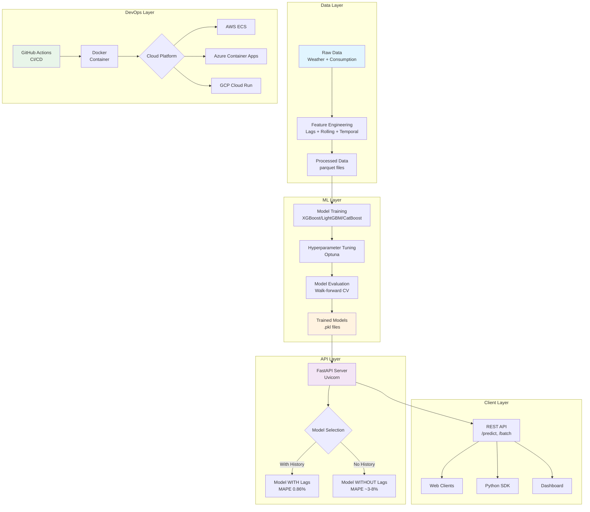
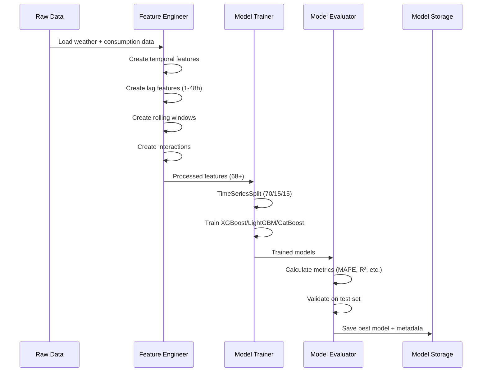
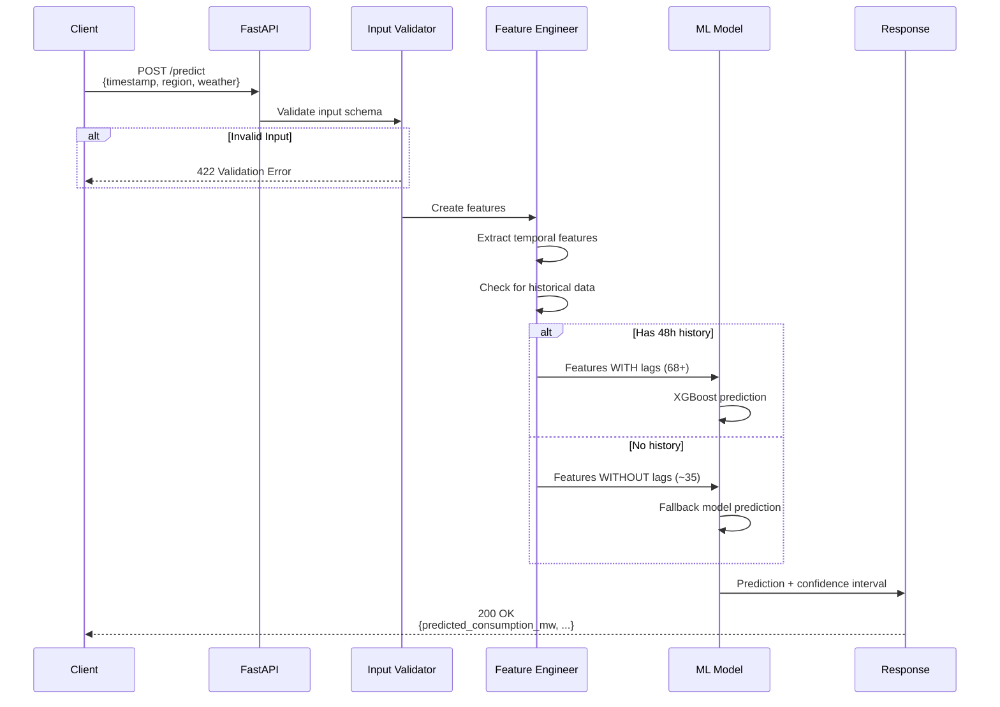
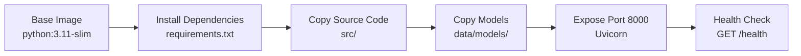
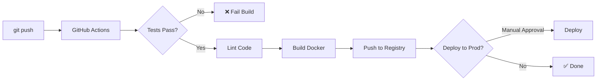

# Architecture Documentation

## System Overview

Energy Forecast PT is an end-to-end ML system for predicting energy consumption in Portugal by region using gradient boosting models.

## 🏗️ High-Level Architecture



## 🔄 Data Flow

### 1. Training Pipeline



### 2. Inference Pipeline



## 📦 Component Details

### 1. Feature Engineering (`src/features/feature_engineering.py`)

**Responsibilities:**
- Transform raw data into model-ready features
- Handle temporal encoding (cyclical features)
- Create lag and rolling window features
- Manage missing data

**Key Methods:**
- `create_temporal_features()` - Hour, day, month, season
- `create_lag_features()` - 1h, 2h, 3h, 6h, 12h, 24h, 48h
- `create_rolling_features()` - Moving averages and std dev
- `create_interaction_features()` - Feature combinations
- `create_all_features()` - Complete pipeline

**Design Decisions:**
- ✅ **Stateless**: No internal state, pure transformation
- ✅ **Composable**: Each method can be used independently
- ✅ **Reproducible**: Same input → same output
- ⚠️ **Memory**: Loads full dataset in memory (trade-off for speed)

### 2. Model Training (`notebooks/02_model_training.ipynb`)

**Responsibilities:**
- Train multiple model types
- Perform hyperparameter optimization
- Validate using time series split
- Save trained models and metadata

**Models Compared:**
1. **Random Forest** - Baseline, interpretable
2. **XGBoost** - Best performer (MAPE 0.86%) ⭐
3. **LightGBM** - Fast training, competitive performance
4. **CatBoost** - Automatic categorical handling

**Optimization:**
- Framework: Optuna with TPE Sampler
- Pruning: MedianPruner for early stopping
- CV Strategy: TimeSeriesSplit (2 folds)
- Trials: 20 per model (optimized for speed)

### 3. API Server (`src/api/main.py`)

**Responsibilities:**
- Serve predictions via REST API
- Load and manage models
- Validate inputs
- Handle errors gracefully

**Endpoints:**
- `GET /` - Health check and info
- `GET /health` - Model status
- `GET /regions` - Available regions
- `POST /predict` - Single prediction
- `POST /predict/batch` - Batch predictions (max 1000)
- `GET /model/info` - Model metadata
- `GET /limitations` - Current limitations

**Design Patterns:**
- **Singleton**: Model loaded once on startup
- **Strategy**: Multiple model selection (with/without lags)
- **Factory**: Feature engineering pipeline creation
- **Facade**: Simplified API interface

### 4. Model Evaluation (`src/models/evaluation.py`)

**Responsibilities:**
- Calculate performance metrics
- Generate visualizations
- Validate model quality
- Compute confidence intervals

**Metrics:**
- **MAE** (Mean Absolute Error) - MW
- **RMSE** (Root Mean Squared Error) - MW
- **MAPE** (Mean Absolute Percentage Error) - %
- **R²** (Coefficient of Determination) - 0 to 1
- **NRMSE** (Normalized RMSE) - %

## 🔐 Security Considerations

### Current State
- ✅ No PII or sensitive data
- ✅ CORS middleware configured
- ✅ Input validation with Pydantic
- ⚠️ No authentication (demo/internal use)
- ⚠️ No rate limiting
- ⚠️ No HTTPS/SSL (deployment responsibility)

### Production Recommendations
1. **Add API Key Authentication**
   ```python
   from fastapi.security import APIKeyHeader
   api_key_header = APIKeyHeader(name="X-API-Key")
   ```

2. **Implement Rate Limiting**
   ```python
   from slowapi import Limiter
   limiter = Limiter(key_func=get_remote_address)
   ```

3. **Use HTTPS Only**
   - Configure SSL certificates
   - Redirect HTTP to HTTPS
   - Use HSTS headers

4. **Add Request/Response Logging**
   - Log all predictions for audit
   - Monitor for suspicious patterns
   - Implement anomaly detection

## 📊 Data Model

### Input Schema (Prediction Request)

```python
{
    "timestamp": str,        # ISO 8601 format
    "region": str,           # One of: Alentejo, Algarve, Centro, Lisboa, Norte
    "temperature": float,    # Celsius
    "humidity": float,       # Percentage (0-100)
    "wind_speed": float,     # km/h
    "precipitation": float,  # mm
    "cloud_cover": float,    # Percentage (0-100)
    "pressure": float        # hPa
}
```

### Output Schema (Prediction Response)

```python
{
    "timestamp": str,
    "region": str,
    "predicted_consumption_mw": float,
    "confidence_interval_lower": float,
    "confidence_interval_upper": float,
    "model_name": str
}
```

### Feature Space

**Model WITH Lags (68+ features):**
- 6 temporal features
- 6 meteorological features
- 7 lag features
- 10 rolling window features
- 15+ interaction features
- 24+ derived features

**Model WITHOUT Lags (~35 features):**
- 6 temporal features
- 6 meteorological features
- 15+ interaction features
- 8+ derived features

## 🚀 Deployment Architecture

### Docker Container



### Cloud Deployment Options

#### Option 1: AWS ECS Fargate
```
GitHub → GitHub Actions → ECR → ECS Fargate → ALB
```
- **Pros**: Serverless, auto-scaling, managed
- **Cons**: Cold starts, AWS-specific
- **Cost**: ~$30-50/month

#### Option 2: Azure Container Apps
```
GitHub → GitHub Actions → ACR → Container Apps → CDN
```
- **Pros**: Easy deployment, Azure integration
- **Cons**: Limited customization
- **Cost**: ~$25-40/month

#### Option 3: GCP Cloud Run
```
GitHub → GitHub Actions → GCR → Cloud Run → Load Balancer
```
- **Pros**: Pay-per-request, fast cold starts
- **Cons**: GCP-specific
- **Cost**: ~$20-35/month

## 🔧 Configuration Management

### Environment Variables

```bash
# API Configuration
API_HOST=0.0.0.0
API_PORT=8000
API_WORKERS=4

# Model Configuration
MODEL_PATH=data/models/
MODEL_WITH_LAGS=xgboost_best.pkl
MODEL_WITHOUT_LAGS=xgboost_no_lags.pkl

# Logging
LOG_LEVEL=INFO
LOG_FORMAT=json

# Performance
MAX_BATCH_SIZE=1000
TIMEOUT_SECONDS=30
```

## 📈 Performance Characteristics

### Latency
- **Single Prediction**: < 10ms (p50), < 50ms (p99)
- **Batch Prediction (100)**: < 100ms (p50), < 500ms (p99)
- **Cold Start**: ~ 2-3 seconds (model loading)

### Throughput
- **Requests/second**: ~200 (single prediction)
- **Predictions/second**: ~2000 (batch mode)

### Resource Usage
- **Memory**: ~500MB (model loaded)
- **CPU**: < 10% (idle), < 50% (under load)
- **Disk**: ~100MB (models + code)

## 🔄 CI/CD Pipeline



**Stages:**
1. **Test** - Run pytest, check coverage
2. **Lint** - black, flake8, isort
3. **Build** - Docker image creation
4. **Push** - Registry upload (ECR/ACR/GCR)
5. **Deploy** - Cloud platform deployment

## 📚 Future Improvements

### Short-term (Nível 2)
- [x] Architecture documentation
- [x] Structured logging
- [ ] MLflow experiment tracking
- [ ] Data validation (Great Expectations)

### Medium-term (Nível 3)
- [ ] Model explainability (SHAP values)
- [ ] A/B testing framework
- [ ] Streamlit dashboard
- [ ] Automated retraining pipeline

### Long-term
- [ ] Real-time streaming predictions
- [ ] Multi-model ensemble in production
- [ ] Automated model monitoring
- [ ] Data drift detection

## 📞 Contact

For questions about the architecture:
- **Technical Lead**: [Your Name]
- **Repository**: [GitHub URL]
- **Documentation**: See [README.md](README.md)

---

**Last Updated**: January 2025
**Version**: 1.0
