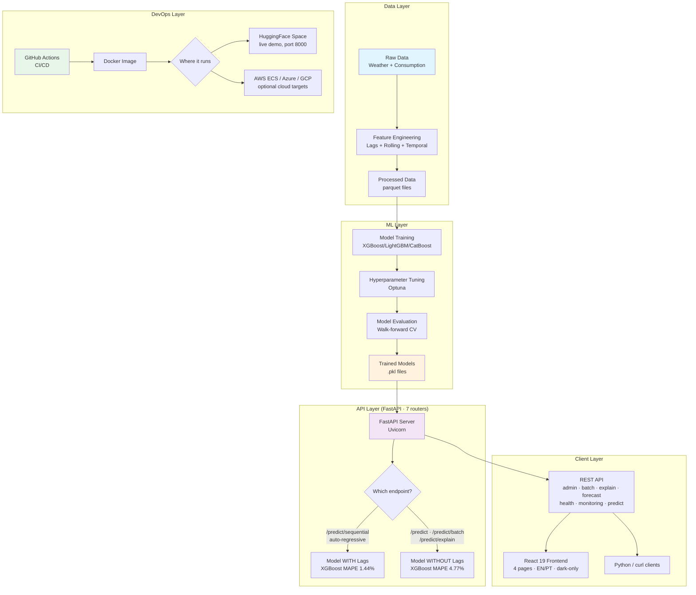
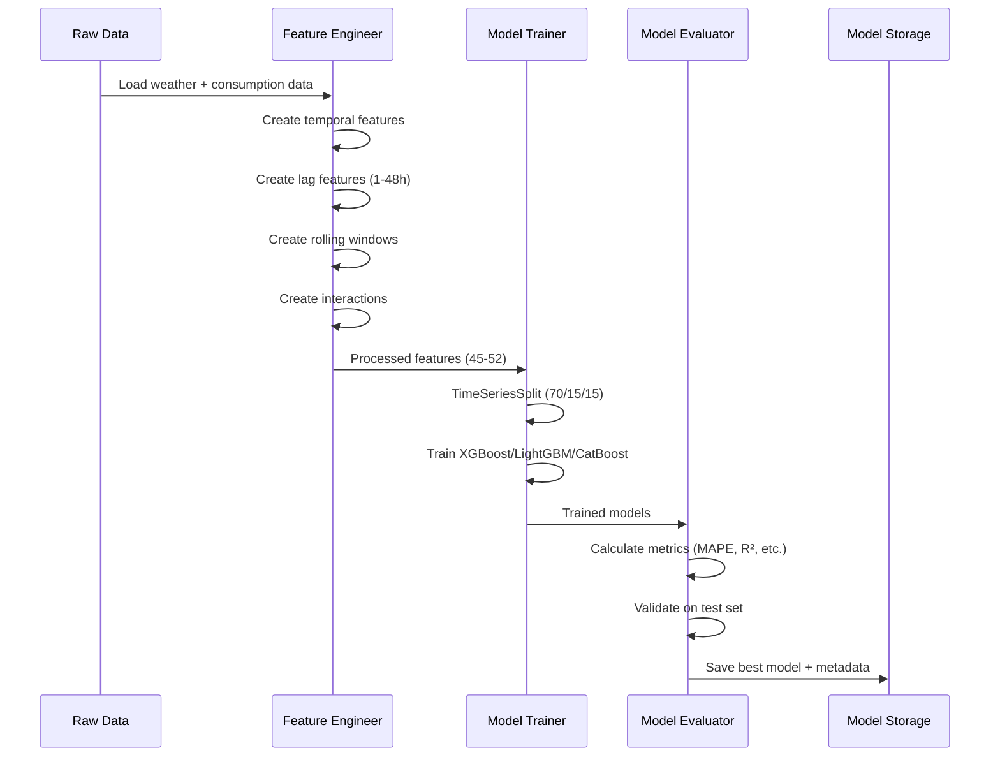
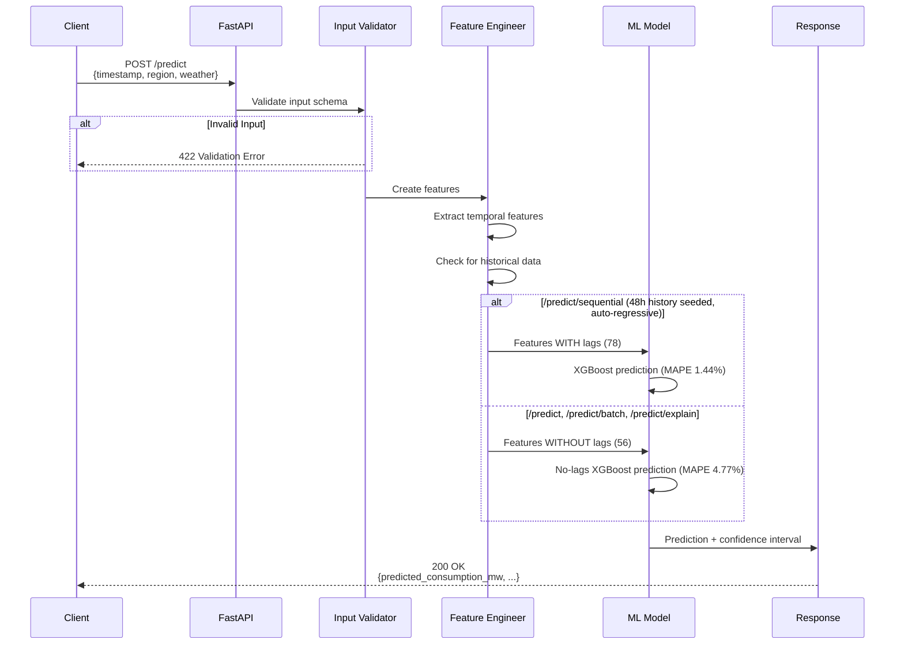
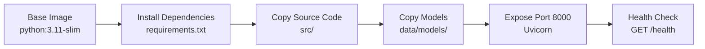
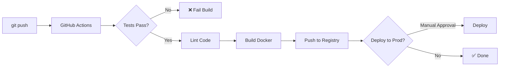

# Architecture Documentation

> **Live demo:** https://pedrom02-energy-forecast-pt.hf.space (HuggingFace Space, Docker SDK, port 8000)
> **Source:** https://github.com/Pedrom2002/energy-forecast-pt

## System Overview

Energy Forecast PT is an end-to-end ML system for forecasting hourly energy consumption in the 5 NUTS-II regions of Portugal. It ships two sibling XGBoost models (no_lags for stateless predictions, with_lags for auto-regressive forecasts), a FastAPI backend with seven routers, and a React 19 + TypeScript frontend with four pages, English/Portuguese internationalisation and a dark-only UI.

## 🏗️ High-Level Architecture



## 🔄 Data Flow

### 1. Training Pipeline



### 2. Inference Pipeline



## 📦 Component Details

### 1. Feature Engineering (`src/features/feature_engineering.py`)

**Responsibilities:**
- Transform raw data into model-ready features
- Handle temporal encoding (cyclical features)
- Create lag and rolling window features
- Manage missing data

**Key Methods:**
- `create_temporal_features()` - Hour, day, month, season
- `create_lag_features()` - 1h, 2h, 3h, 6h, 12h, 24h, 48h
- `create_rolling_features()` - Moving averages and std dev
- `create_interaction_features()` - Feature combinations
- `create_all_features()` - Complete pipeline

**Design Decisions:**
- ✅ **Stateless**: No internal state, pure transformation
- ✅ **Composable**: Each method can be used independently
- ✅ **Reproducible**: Same input → same output
- ⚠️ **Memory**: Loads full dataset in memory (trade-off for speed)

### 2. Model Training (`scripts/retrain.py`)

**Responsibilities:**
- Set global seeds for reproducibility
- Evaluate baseline models (persistence, seasonal naive, moving average)
- Train 4 model types with 5-fold time-series CV
- Optuna hyperparameter optimisation (50 trials, 5 CV folds)
- Permutation-importance feature selection
- Compute conformal prediction calibration
- Log experiments to file-based tracker

**Models Compared:**
1. **CatBoost** - Typically selected (best CV RMSE)
2. **XGBoost** - Competitive, fast inference
3. **LightGBM** - Memory-efficient, fast training
4. **Random Forest** - Robust baseline

**Baselines** (every ML model must beat):
1. Persistence (lag-1 naive)
2. Seasonal Naive (daily, period=24h)
3. Seasonal Naive (weekly, period=168h)
4. Moving Average (24h and 168h windows)

**Optimization:**
- Framework: Optuna with TPE Sampler (seeded)
- CV Strategy: TimeSeriesSplit (5 folds)
- Trials: 50 per model (sufficient for convergence)
- Timeout: 3600s safety net

### 3. API Server (`src/api/main.py` + `src/api/routers/*`)

The FastAPI app mounts seven routers, each defined in `src/api/routers/`:

| Router | File | Purpose |
|---|---|---|
| `health` | `health.py` | `GET /`, `GET /health`, `GET /regions`, `GET /limitations` — always unauthenticated. |
| `predict` | `predict.py` | `POST /predict` (single), `POST /predict/sequential` (auto-regressive, with_lags). |
| `batch` | `batch.py` | `POST /predict/batch` — vectorised, up to 1000 items. |
| `explain` | `explain.py` | `POST /predict/explain` — prediction + top-N feature importance (SHAP or global). |
| `forecast` | `forecast.py` | Horizon-specific helpers (1 h, 6 h, 12 h, 24 h multi-step). |
| `monitoring` | `monitoring.py` | `GET /metrics/summary`, `GET /model/coverage`, `POST /model/coverage/record`, `GET /model/drift`, `POST /model/drift/check`, `GET /model/info`. |
| `admin` | `admin.py` | `POST /admin/reload-models` — requires `ADMIN_API_KEY`. |

Interactive OpenAPI docs are served at `/docs` (`https://pedrom02-energy-forecast-pt.hf.space/docs` in production).

**Instrumentation:** `prometheus-fastapi-instrumentator` auto-registers a `/metrics` endpoint on startup when available.

**Coverage seed at startup:** the backend seeds 168 synthetic observations into the `CoverageTracker` on startup (~92 % empirical coverage) so the Monitoring page is never empty on the public demo. See `src/api/monitoring.py`.

**Design Patterns:**
- **Singleton**: Model loaded once on startup
- **Strategy**: Multiple model selection (with/without lags)
- **Factory**: Feature engineering pipeline creation
- **Facade**: Simplified API interface

### 4. Model Evaluation (`src/models/evaluation.py`)

**Responsibilities:**
- Calculate performance metrics
- Generate visualizations
- Validate model quality
- Compute confidence intervals

**Metrics:**
- **MAE** (Mean Absolute Error) - MW
- **RMSE** (Root Mean Squared Error) - MW
- **MAPE** (Mean Absolute Percentage Error) - %
- **R²** (Coefficient of Determination) - 0 to 1
- **NRMSE** (Normalized RMSE) - %

## 🔐 Security Considerations

### Current State
- ✅ No PII or sensitive data
- ✅ CORS middleware configured
- ✅ Input validation with Pydantic
- ✅ API Key Authentication (HMAC-based, timing-safe)
- ✅ Rate limiting (in-memory or Redis-backed)
- ✅ Security headers middleware
- ✅ Non-root Docker user
- ✅ pip-audit, bandit, detect-secrets in CI
- ✅ Trivy container scanning + SBOM generation
- ⚠️ HTTPS/SSL (deployment responsibility via nginx/cloud LB)

## 📊 Data Model

### Input Schema (Prediction Request)

```python
{
    "timestamp": str,        # ISO 8601 format
    "region": str,           # One of: Alentejo, Algarve, Centro, Lisboa, Norte
    "temperature": float,    # Celsius
    "humidity": float,       # Percentage (0-100)
    "wind_speed": float,     # km/h
    "precipitation": float,  # mm
    "cloud_cover": float,    # Percentage (0-100)
    "pressure": float        # hPa
}
```

### Output Schema (Prediction Response)

```python
{
    "timestamp": str,
    "region": str,
    "predicted_consumption_mw": float,
    "confidence_interval_lower": float,
    "confidence_interval_upper": float,
    "model_name": str
}
```

### Feature Space

Authoritative lists live in `data/models/features/feature_names.txt` (78) and `feature_names_no_lags.txt` (56).

**with_lags (78 features — used by `/predict/sequential`):** temporal + cyclical, weather (raw + derived), Portuguese holidays, interactions, 7 lag features, 20 rolling-window features, diff features.

**no_lags (56 features — used by `/predict`, `/predict/batch`, `/predict/explain`):** same feature groups as above minus the lag / rolling / diff features.

### Frontend (React 19 + TypeScript + Vite)

Four pages — one-to-one with `frontend/src/pages/`:

| Route | Component | Purpose | Calls |
|---|---|---|---|
| `/` | `Dashboard.tsx` | Landing / entry page with KPIs and links to the other pages. | `/health`, `/metrics/summary` |
| `/predict` | `Predict.tsx` | Single-point prediction form ("Previsão Pontual"). | `POST /predict` |
| `/forecast` | `Forecast.tsx` | Sequential forecast over N hours; includes an embedded collapsible SHAP explainability panel (`components/ExplanationPanel.tsx`). | `POST /predict/batch`, `POST /predict/explain` |
| `/monitoring` | `Monitoring.tsx` | Coverage tracker only — shows a 168-observation sliding window and the seed banner. | `GET /model/coverage` |

Sidebar navigation (`frontend/src/components/Layout.tsx`) has exactly four entries: **Dashboard**, **Previsão Pontual**, **Forecast**, **Monitoring**. The older **Batch** page has been merged into **Forecast**, and the older **Explicabilidade** page has been replaced by the embedded panel inside **Forecast**. The drift bar chart and simulator previously on **Monitoring** have been removed.

**i18n.** `react-i18next` with English as the default and a Portuguese translation; the language is toggled from a footer control (`components/LanguageToggle.tsx`).

**Theme.** Dark-only. The light-mode design tokens are still defined in the Tailwind theme but no toggle is exposed in the UI.

## 🚀 Deployment Architecture

### Live — HuggingFace Spaces (primary)

The project is deployed as a Docker-SDK HuggingFace Space at
**https://pedrom02-energy-forecast-pt.hf.space**. The Space builds from the
root `Dockerfile`, listens on port 8000 and serves the FastAPI backend plus
the pre-built React bundle in a single container. No authentication is
configured — the demo is intentionally open.

See [DEPLOYMENT.md](DEPLOYMENT.md#huggingface-spaces-live-demo) for a full
walkthrough.

### Docker Container



### Cloud Deployment Options

#### Option 1: AWS ECS Fargate
```
GitHub → GitHub Actions → ECR → ECS Fargate → ALB
```
- **Pros**: Serverless, auto-scaling, managed
- **Cons**: Cold starts, AWS-specific
- **Cost**: ~$30-50/month

#### Option 2: Azure Container Apps
```
GitHub → GitHub Actions → ACR → Container Apps → CDN
```
- **Pros**: Easy deployment, Azure integration
- **Cons**: Limited customization
- **Cost**: ~$25-40/month

#### Option 3: GCP Cloud Run
```
GitHub → GitHub Actions → GCR → Cloud Run → Load Balancer
```
- **Pros**: Pay-per-request, fast cold starts
- **Cons**: GCP-specific
- **Cost**: ~$20-35/month

## 🔧 Configuration Management

### Environment Variables

```bash
# API Configuration
API_HOST=0.0.0.0
API_PORT=8000
API_WORKERS=4

# Model Configuration
MODEL_PATH=data/models/
MODEL_WITH_LAGS=xgboost_best.pkl
MODEL_WITHOUT_LAGS=xgboost_no_lags.pkl

# Logging
LOG_LEVEL=INFO
LOG_FORMAT=json

# Performance
MAX_BATCH_SIZE=1000
TIMEOUT_SECONDS=30
```

## 📈 Performance Characteristics

### Latency
- **Single Prediction**: < 10ms (p50), < 50ms (p99)
- **Batch Prediction (100)**: < 100ms (p50), < 500ms (p99)
- **Cold Start**: ~ 2-3 seconds (model loading)

### Throughput
- **Requests/second**: ~200 (single prediction)
- **Predictions/second**: ~2000 (batch mode)

### Resource Usage
- **Memory**: ~500MB (model loaded)
- **CPU**: < 10% (idle), < 50% (under load)
- **Disk**: ~100MB (models + code)

## 🔄 CI/CD Pipeline



**Stages:**
1. **Test** - Run pytest, check coverage
2. **Lint** - black, flake8, isort
3. **Build** - Docker image creation
4. **Push** - Registry upload (ECR/ACR/GCR)
5. **Deploy** - Cloud platform deployment

### 5. Reproducibility & Tracking

**Established in Pipeline v6, retained in v7:**

| Component | File | Purpose |
|---|---|---|
| **Global seeds** | `src/utils/reproducibility.py` | Deterministic random state |
| **Data hashing** | `src/utils/reproducibility.py` | DataFrame SHA-256 for version verification |
| **Experiment tracker** | `src/models/experiment_tracker.py` | File-based run logging |
| **Baseline models** | `src/models/baselines.py` | Performance floor comparison |
| **Feature selection** | `src/models/feature_selection.py` | Correlation + permutation importance |
| **DVC pipeline** | `dvc.yaml` | Reproducible pipeline with data versioning |

### 6. Documentation

| Document | Purpose |
|---|---|
| [ML_PIPELINE.md](ML_PIPELINE.md) | Complete ML pipeline technical reference |
| [DATA_DICTIONARY.md](DATA_DICTIONARY.md) | All data schemas, features, and metadata |
| [MODEL_CARD.md](MODEL_CARD.md) | Model capabilities, limitations, and ethics |
| [DEPLOYMENT.md](DEPLOYMENT.md) | Cloud deployment guides |
| [MONITORING.md](MONITORING.md) | Production monitoring setup |
| [SECURITY.md](SECURITY.md) | Security architecture |
| [DECISIONS.md](DECISIONS.md) | Trade-offs and reversals (PT) |

## Future Improvements

### Completed in v7
- [x] Migration to honest regional dataset (e-Redes CP4 direct)
- [x] Removal of static-share disaggregation artefact
- [x] Retraining with real regional dynamics (MAPE 1.44% with_lags, 4.77% no_lags)

### Completed in v5/v6
- [x] Architecture documentation
- [x] Structured logging
- [x] File-based experiment tracking
- [x] Data versioning (DVC)
- [x] Baseline model comparison
- [x] Feature selection pipeline
- [x] Reproducibility module
- [x] Comprehensive ML pipeline documentation

### Completed in v2.2 (April 2026)
- [x] Frontend consolidated to 4 pages (Dashboard, Previsão Pontual, Forecast, Monitoring)
- [x] Explicabilidade merged into Forecast as a collapsible SHAP panel
- [x] Batch page merged into Forecast
- [x] Monitoring simplified to the coverage tracker (drift bar chart / simulator removed)
- [x] `react-i18next` English + Portuguese with footer toggle
- [x] Dark-only UI (light-mode tokens retained but no toggle)
- [x] Live HuggingFace Space deployment
- [x] Startup coverage seed (168 synthetic observations, ~92 % coverage)

### Completed in v2.1
- [x] Dark mode with design system and semantic color tokens
- [x] Comprehensive test suite (integration, load, stress, property-based, frontend)
- [x] Mutation testing setup (mutmut)
- [x] Model explainability (SHAP / global importance via `/predict/explain`)
- [x] Error boundaries and 404 page handling
- [x] Production build optimization (code splitting)

### Remaining
- [ ] A/B testing framework
- [ ] Automated retraining pipeline (Airflow/Prefect)
- [ ] Real-time streaming predictions
- [ ] pandera / Great Expectations data validation

---

**Last Updated**: April 2026
**Version**: 2.2 (Pipeline v8)
